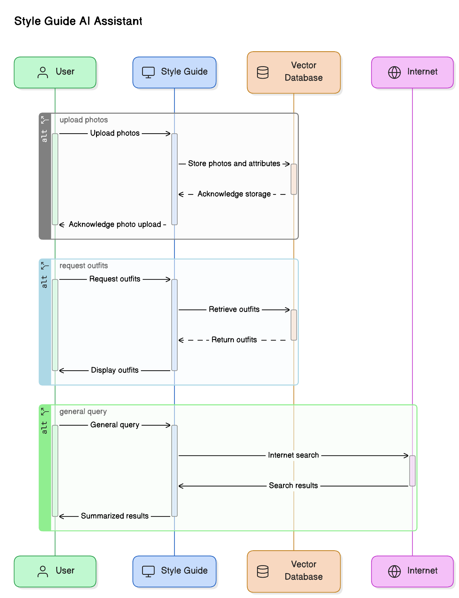
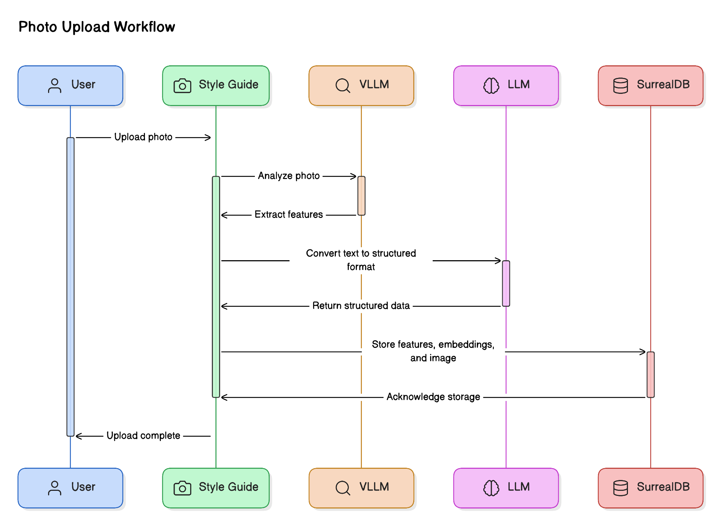
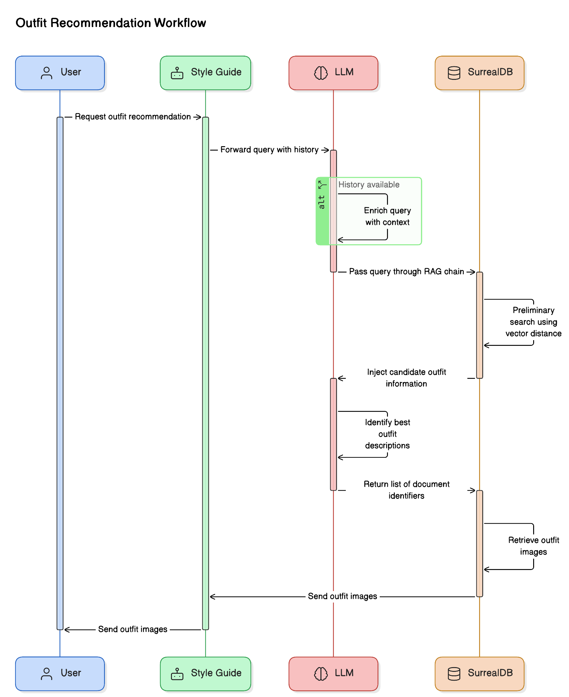

Style Guide - AI Fashion Assistant
==================================

Overview
--------

**Style Guide** is a voice enabled AI assistant that lets you talk to your wardrobe.  
When you upload your photos, it analyzes them and identifies the kind of clothes you are wearing and other interesting 
attributes, like color, style, etc., and stores them along with your photo in a vector database.  

You can then ask **Style Guide** to show you cloths matching a certain criteria, like:
* Show me casual wear
* Show me formal wear
* Show me blue shirts
* I am going on a vacation to the Mediterranean. Suggest some outfits to pack.

**Style Guide** will find up to 4 outfits for that criteria and display the photos to you. 

**Style Guide** can also connect to the Internet and look up information like local weather, events, etc., for you and 
share that information with you in its voice. 
Furthermore, any information it pulls from the Internet, it can use as additional context when looking up outfits. 

Is it a sunny day outside? Maybe go with 
bright-colored outfits. Is it cloudy? How about some darker shades?

[](https://www.youtube.com/watch?v=aWYGDufOR_k)



Technologies
------------

1. Speech to text is using [OpenAI's open source Whisper mini](https://huggingface.co/openai/whisper-small) model.
2. Text to Audio is using [Suno's open source Bark small](https://huggingface.co/suno/bark-small) model. 
3. WebRTC scaffolding from [WebRTC AI Voice Chat](https://github.com/lalanikarim/webrtc-ai-voice-chat/) project.
4. Hosted AI Inference [NVIDIA Inference Microservice (NIM)](https://www.nvidia.com/en-us/ai/):
   1. Text-to-text LLM [meta/llama3-8b-instruct](https://build.nvidia.com/meta/llama3-8b)
   2. Image-to-text VLLM [microsoft/phi-3-vision-128k-instruct](https://build.nvidia.com/microsoft/phi-3-vision-128k-instruct)
   3. Retrieval Embeddings [nvidia/embed-qa-4](https://build.nvidia.com/nvidia/embed-qa-4)
5. Document and Vector store database [SurrealDB](https://surrealdb.com/)
6. Web Search using [DuckDuckGo](https://duckduckgo.com/)
7. GenAI framework [LangChain](https://www.langchain.com/)
8. GenAI API calls monitoring and tracing [LangSmith from LangChain](https://docs.smith.langchain.com/)

Workflows
---------

### Photo Upload Workflow

1. Uploaded photos are first analyzed using the `phi-3-vision-128k-instruct` VLLM.
2. The plain text information extracted from the photo is then passed through `llama3-8b-instruct` LLM model with a
`tool calling` wrapper to convert the plain text information into structured format for easy feature extraction.
3. The extracted features, along with their `embedding vectors` and the original image are then stored within the 
`SurrealDB` database.



### AI Agent Workflow

1. User's voice is first transcribed using `Whisper` and the transcription is passed to the AI Agent.
2. The Agent has access to `llama3-8b-instruct` LLM for language model tasks and two tools:
   1. Internet search using `DuckDuckGo`
   2. Outfit recommendation system
3. Simple conversational requests are usually handled by the LLM itself.
4. Information lookup requests, like weather information etc., are handled by the Internet search tool.
5. Requests related to outfits lookup are handled by the Outfit recommendation system.
6. Large text responses, especially from the web search, are also summarized by the LLM before sending the response to 
the user.
7. Finally, if the generated response is text, then a voice response is synthesized and played back to the user. 
8. If the response is a list of images, then they are displayed within the chat interface.


### Outfit Recommendation Workflow

1. The AI Agent directs all outfit related queries to the Outfit Recommender tool along with the history of any past 
conversations until that point.
2. If conversational history is available, then the query is further enriched by extracting additional context from it.
3. The query is then passed through a retrieval augmented generation (RAG) chain backed by the vector database as the 
retrieval source.
4. The retrieval source injects information about candidate outfits by doing a preliminary search by employing a vector 
distance metric, like *cosine similarity* between the embeddings of the user query and the embeddings for the outfit 
descriptions stored within the vector database.
5. The LLM then attempts to identify which of the retrieved outfit descriptions best meets the criteria specified in 
the user's query and returns a list of document identifiers.
6. The document identifiers are then passed back into the vector database to retrieve the outfit images which are then 
handed over to the AI Agent which it later sends to the user.



### Installation

1. Ensure you have Python 3.12.
   ```
   python --version
   Python 3.12.4
   ```
2. You will need the following API Keys:
   1. Personal Key from your organization's profile on https://ngc.nvidia.com/ is needed to make API calls to the hosted
      NIM endpoints.
   2. Optionally, API Key from https://smith.langchain.com for LangSmith tracing.
3. `SurealDB` installation instructions can be found here: https://surrealdb.com/install
4. Download the source code and create a python virtual environment in the project's source folder.
   ```
   python -m venv .venv
   source .venv/bin/activate
   ```
5. Download python package dependencies for the project.
   ```
   pip install -r requirements
   ```
6. Create a `.env` file with the following entries.
   ```
   LANGCHAIN_API_KEY=<LangChain API Key for LangSmith> # Optional
   LANGCHAIN_TRACING_V2=false # true to enable LangSmith tracing. API KEY is needed for this.
   LANGCHAIN_PROJECT="<Project name for LangSmith tracing>"
   NVIDIA_API_KEY=<NVIDIA API KEY to access NGC Catalog>
   NVIDIA_LLM_MODEL=meta/llama3-8b-instruct # Can be another JSON capable LLM hosted on NIM
   NVIDIA_VLLM_MODEL=microsoft/phi-3-vision-128k-instruct # Can be another suitable VLLM hosted on NIM
   NVIDIA_EMBEDDINGS_MODEL=NV-Embed-QA # Can be another embedding model hosted on NIM
   ```
7. Start the server.
   ```
   python -m server
   ======== Running on http://0.0.0.0:8080 ========
   (Press CTRL+C to quit)
   ```
8. The application can now be accessed from your browser by visiting http://localhost:8080

